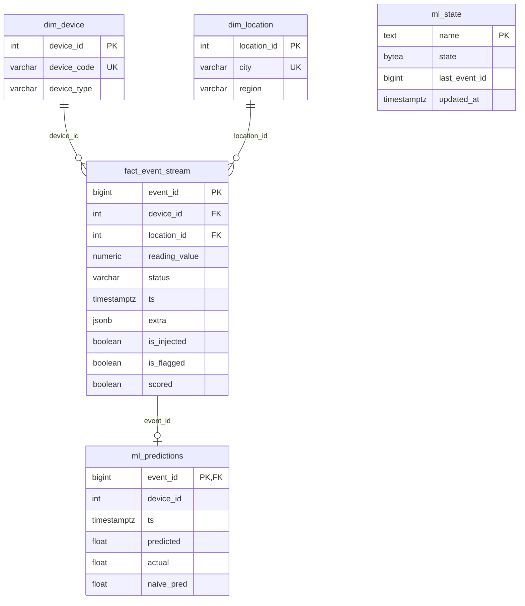

# Project 1: Streaming Analytics Pipeline on Azure

IoT sensor readings are generated, stored in Azure PostgreSQL, checked for outliers, used to train an online forecasting model, and shown on a live dashboard.

```
Azure Function (timer, every minute)
  generatedata  :00  -> inserts 320 readings into stream.fact_event_stream
  analyze       :30  -> robust z-score outlier detector + River online model
                          -> writes is_flagged, ml_predictions, ml_state
                 |
         Azure Database for PostgreSQL (Flexible Server, schema "stream")
                 |
Azure Web App (Streamlit dashboard, auto-refresh)
```

## Components

| Part | Location | Runs on |
|---|---|---|
| Schema creation | `create_schema.py` | once, locally |
| Generator + analyzer | `function_app/function_app.py`, `function_app/analytics_core.py` | Azure Functions (Python v2, timer triggers) |
| Dashboard | `Dashboard/app.py` | Azure App Service (deployed by GitHub Actions) |
| Verification | `verify_schema.py`, `measure_throughput.py`, `check_data.py`, `check_analytics.py` | locally, read-only against the DB |

## Database schema (schema `stream`)



(Column lists were checked against `docs/schema_report.md`, generated from the live database. `ml_state` is a standalone table and has no relationships.)

- **dim_device**: 20 fixed devices (4 sensor types x 5 cities).
- **dim_location**: 5 cities with a region.
- **fact_event_stream**: one row per reading. `is_injected` is the ground truth written by the generator (about 2% corrupted readings). `is_flagged` is the detector's output. `scored` marks rows the detector has processed. The detector never reads `is_injected`.
- **ml_predictions**: one row per forecast, holding the model's prediction (`predicted`), the true value (`actual`) and the naive last-value prediction (`naive_pred`), used to compute the running error.
- **ml_state**: the serialized online model (pickled + zlib), so the model survives between function runs.

Indexes: `idx_fact_ts`, `idx_fact_device`, `idx_fact_unscored` (partial, on unscored rows), `idx_pred_ts`.

## Ingestion process

1. Timer trigger `generatedata` fires every minute (`0 * * * * *`).
2. It builds 16 readings for each of the 20 devices (320 rows). Values follow a city baseline + daily cycle + noise. About 2% are corrupted (spike, drop, or a -999 sensor fault, which gets `status = 'error'`). Timestamps are spread across the previous 60 seconds.
3. Dimension rows are upserted (`ON CONFLICT DO NOTHING`), then ids are looked up.
4. All 320 rows go in with a single batched `execute_values` insert inside one transaction.

## Analytics

- **Outlier detection**: per-device robust z-score, `z = 0.6745 (x - median) / MAD`, flag if `|z| > 3.5`. Baseline is the device's last 300 clean readings. Observed precision about 0.96-0.97, recall 1.00 against `is_injected`.
- **Online ML**: River `StandardScaler | LinearRegression` per device, predicting the change from the last value. Evaluated prequentially (predict first, then learn). Flagged and error readings are excluded from training. Compared with a naive (last value) and an exponentially weighted baseline.

## Setup

1. Create an Azure PostgreSQL Flexible Server and allow your client IP (and "Allow public access from any Azure service") under Networking.
2. Copy `.env.example` to `.env` and fill in `DATABASE_HOST`, `DATABASE_NAME`, `DATABASE_USER`, `DATABASE_PASSWORD`, `DATABASE_PORT`.
3. `pip install -r requirements.txt`, then `python create_schema.py`.
4. Deploy `function_app/` to an Azure Function App (same DATABASE_* values as Application Settings).
5. Deploy `Dashboard/` to an App Service (same values as environment variables). The GitHub Actions workflow does this on every push to `Dashboard/`.

## Verifying

```
python verify_schema.py          # tables, PK/FK/unique checks, integrity -> docs/schema_report.md
python measure_throughput.py 6 120   # per-minute counts (last 6 h) + 120 s live sample -> docs/throughput_report.md
python check_analytics.py        # detector and model health
```

Never commit `.env`. Credentials belong in Application Settings on Azure.
